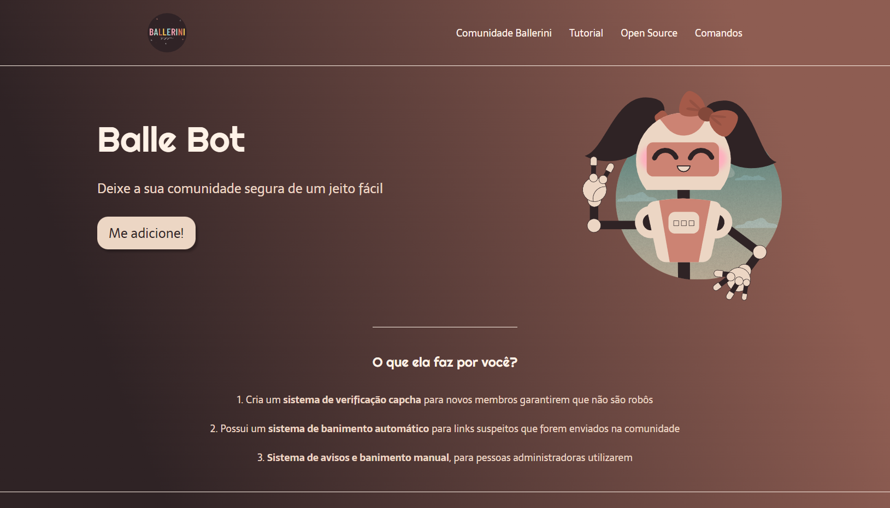

# Landing Page - Balle Bot

Projeto desenvolvido através de uma videoaula da Rafaella Ballerini para a construção de uma landing page.

### Preview do Projeto

[Clique aqui para acessar](https://marqueba.github.io/landing-page/)

## Tecnologias Utilizadas

- ``HTML``
- ``CSS``
- ``Git e Github``

## Contato

| [ Marcos Reis Dutra](https://github.com/Marqueba)
